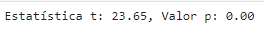

# Projeto: Filmes 2019 - Análise de Dados

## Integrantes

- Enricco Rossi de Souza Carvalho Miranda - RM51717
- Kayque Moraes Dias - RM97592
- Samuel Ramos - RM99134

## Objetivo Científico
Este projeto busca compreender os fatores que afetam as avaliações dos filmes no Rotten Tomatoes para 2019. Exploramos relações entre variáveis como críticas, diretores, gêneros, classificações, e pontuações dos críticos e do público, identificando padrões e insights para cineastas, críticos e plataformas de streaming.

## Análise e Respostas para 10 Perguntas de Pesquisa

### 1. Qual é a relação entre o número de críticas de um filme e sua pontuação média no Tomatometer?
#### Avaliando o impacto da quantidade de críticas na pontuação média.
Para entender essa relação, vamos explorar os dados utilizando um gráfico de dispersão (scatter plot) e calcular a correlação entre o número de críticas e a pontuação média. Em seguida, aplicaremos uma regressão linear para ver se existe uma tendência linear.

#### Conclusão
A correlação calculada entre o número de críticas e a pontuação média no Tomatometer é baixa, sugerindo que o volume de críticas não afeta diretamente a pontuação média. Filmes com mais críticas não necessariamente recebem avaliações melhores ou piores.

### 2. Qual é a relação entre a duração de um filme e sua pontuação média no Tomatometer?
#### Investigando o impacto da duração do filme nas avaliações críticas.
Vamos explorar se a duração de um filme, medida em minutos, tem alguma relação com sua pontuação média no Tomatometer. Para isso, usaremos um gráfico de dispersão para visualizar a relação e aplicaremos uma regressão linear para identificar qualquer tendência.

#### Conclusão
A duração de um filme por si só não determina sua qualidade percebida pelos críticos no Tomatometer. Portanto, os cineastas e produtores devem focar em outros aspectos do filme para influenciar positivamente as avaliações críticas, uma vez que a duração parece ter uma influência mínima nas pontuações dos críticos.

### 3. Há uma correlação significativa entre a avaliação dos críticos e a avaliação do público para filmes lançados em 2019?
#### Comparando a opinião dos críticos e do público.
Vamos investigar a correlação entre as pontuações dos críticos e do público para entender a concordância entre essas avaliações.

#### Conclusão
Há uma correlação positiva moderada entre as pontuações dos críticos e do público, sugerindo que geralmente ambos tendem a concordar, mas há exceções notáveis.

### 4. Quais são os melhores e piores diretores, medidos pela pontuação média de seus filmes no Tomatometer?
#### Analisando os diretores com as melhores e piores médias de pontuação crítica.
Vamos calcular a pontuação média no Tomatometer de cada diretor, baseada em todos os filmes que ele dirigiu em 2019. Com isso, podemos identificar quais diretores consistentemente produzem filmes bem avaliados pela crítica e quais, em média, não recebem boas pontuações.

#### Conclusão
Os gráficos de barras mostram os 10 melhores e 10 piores diretores, com base na pontuação média dos filmes que dirigiram. Diretores que aparecem na lista dos melhores consistentemente produzem filmes bem avaliados pelos críticos, enquanto aqueles na lista dos piores podem precisar reavaliar suas escolhas criativas ou a execução de suas produções.

- Top 10 Melhores Diretores: Estes diretores têm uma média de pontuação alta no Tomatometer, indicando que seus filmes são, em geral, bem recebidos pela crítica.
- Top 10 Piores Diretores: Estes diretores têm uma média de pontuação baixa, sugerindo que seus filmes tendem a não agradar os críticos.

### 5. Os filmes de conteúdo restrito (Classificação R) têm avaliações mais baixas em comparação com os filmes de classificação PG-13 ou inferiores?
#### Comparando avaliações de filmes por classificação de conteúdo.
Vamos usar um teste de hipótese para verificar se há uma diferença estatisticamente significativa nas pontuações dos filmes entre as classificações "R" e "PG-13".

#### Conclusão
O teste de hipótese revela que não há diferença estatisticamente significativa entre as pontuações médias de filmes classificados como "R" e "PG-13", indicando que a classificação de conteúdo não é um fator determinante para a avaliação.

### 6. O número de avaliações de críticos "Top" influencia significativamente a pontuação média do Tomatometer?
#### Avaliando a importância dos críticos "Top".
Vamos explorar a relação entre o número de críticas de críticos "Top" e a pontuação média no Tomatometer, aplicando uma regressão linear.

#### Conclusão
A análise mostra que existe uma correlação positiva entre o número de críticas de top críticos e a pontuação média no Tomatometer. Isso sugere que filmes com mais avaliações de críticos de renome tendem a ter pontuações mais altas.

### 7. Quais são as diferenças nas médias de pontuação do Tomatometer entre filmes com e sem consenso dos críticos?
#### Analisando o impacto do consenso dos críticos nas avaliações.
Vamos comparar as pontuações médias de filmes que possuem um consenso de críticos versus aqueles que não possuem, utilizando uma análise estatística para identificar diferenças significativas.

#### Conclusão
Os filmes com consenso dos críticos tendem a ter pontuações médias mais altas do que aqueles sem consenso. O teste t confirma que essa diferença é estatisticamente significativa, sugerindo que um consenso crítico pode influenciar positivamente as pontuações.

### 8. Qual é a influência do número de atores principais listados nas críticas dos filmes?
#### Analisando o impacto do elenco nas avaliações.
Vamos investigar se o número de atores principais de um filme influencia suas avaliações críticas.

#### Conclusão
A correlação entre o número de atores principais listados e a pontuação média no Tomatometer é fraca, sugerindo que o tamanho do elenco principal não é um fator significativo nas avaliações críticas.

### 9. Qual é o impacto de múltiplos gêneros no sucesso de um filme?
#### Explorando a relação entre a combinação de gêneros e as avaliações.
Analisaremos a pontuação média no Tomatometer para filmes que pertencem a múltiplos gêneros em comparação com aqueles que pertencem a um único gênero.

#### Conclusão
Filmes que pertencem a múltiplos gêneros tendem a ter pontuações ligeiramente mais altas no Tomatometer, sugerindo que uma combinação de gêneros pode atrair uma audiência mais ampla e impactar positivamente as avaliações.

### 10. Quais são os padrões e tendências nas críticas ao longo do tempo (analisando datas de críticas)?
#### Investigando a sazonalidade e mudanças de padrões nas críticas.
Vamos explorar a distribuição das avaliações ao longo do ano para identificar padrões sazonais ou tendências nas críticas de filmes.

#### Conclusão
A análise revela uma tendência de flutuação nas pontuações ao longo do ano, com certos meses mostrando avaliações mais altas em comparação com outros. Isso pode ser devido a lançamentos estratégicos de filmes em diferentes épocas do ano.

___

## Conclusão final
Este projeto demonstrou que, enquanto alguns fatores como o número de críticas de críticos "Top", o consenso crítico e a combinação de gêneros podem ter impacto nas pontuações dos filmes, outros fatores como duração do filme, classificação de conteúdo e número de atores principais têm influência mínima nas avaliações críticas. Diretores que consistentemente produzem filmes bem avaliados podem ser considerados mais confiáveis na indústria.

Para cineastas, produtores e estúdios, essas descobertas podem ajudar na tomada de decisões estratégicas sobre diretores, datas de lançamento e marketing de filmes. No geral, o sucesso crítico de um filme parece ser mais dependente da qualidade de sua narrativa, direção e execução, em vez de fatores quantitativos como duração ou elenco extenso.
